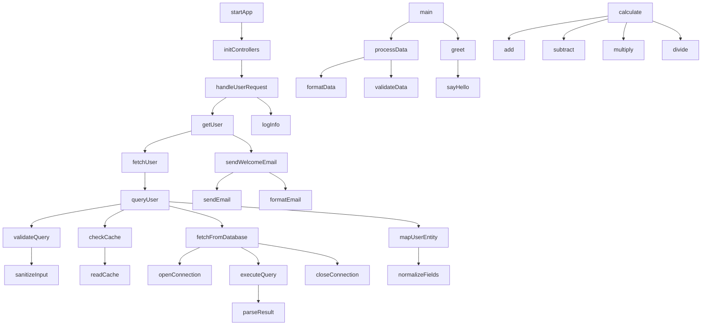

```mermaid
graph TD
  startApp["startApp"]
  initControllers["initControllers"]
  handleUserRequest["handleUserRequest"]
  getUser["getUser"]
  processData["processData"]
  formatData["formatData"]
  validateData["validateData"]
  main["main"]
  queryUser["queryUser"]
  validateQuery["validateQuery"]
  sanitizeInput["sanitizeInput"]
  checkCache["checkCache"]
  readCache["readCache"]
  fetchFromDatabase["fetchFromDatabase"]
  openConnection["openConnection"]
  executeQuery["executeQuery"]
  parseResult["parseResult"]
  closeConnection["closeConnection"]
  mapUserEntity["mapUserEntity"]
  normalizeFields["normalizeFields"]
  greet["greet"]
  sayHello["sayHello"]
  sendWelcomeEmail["sendWelcomeEmail"]
  sendEmail["sendEmail"]
  formatEmail["formatEmail"]
  fetchUser["fetchUser"]
  logInfo["logInfo"]
  add["add"]
  subtract["subtract"]
  multiply["multiply"]
  divide["divide"]
  calculate["calculate"]

  startApp --> initControllers
  initControllers --> handleUserRequest
  handleUserRequest --> getUser
  handleUserRequest --> logInfo
  getUser --> fetchUser
  getUser --> sendWelcomeEmail
  processData --> formatData
  processData --> validateData
  main --> processData
  queryUser --> validateQuery
  queryUser --> checkCache
  queryUser --> fetchFromDatabase
  queryUser --> mapUserEntity
  validateQuery --> sanitizeInput
  checkCache --> readCache
  fetchFromDatabase --> openConnection
  fetchFromDatabase --> executeQuery
  fetchFromDatabase --> closeConnection
  executeQuery --> parseResult
  mapUserEntity --> normalizeFields
  greet --> sayHello
  main --> greet
  sendWelcomeEmail --> formatEmail
  sendWelcomeEmail --> sendEmail
  fetchUser --> queryUser
  calculate --> add
  calculate --> multiply
  calculate --> subtract
  calculate --> divide
```

View at: https://mermaid.live