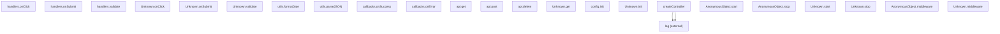

# Call Graph Visualization

```mermaid
graph TD
  handlers_onClick["handlers.onClick"]
  handlers_onSubmit["handlers.onSubmit"]
  handlers_validate["handlers.validate"]
  Unknown_onClick["Unknown.onClick"]
  Unknown_onSubmit["Unknown.onSubmit"]
  Unknown_validate["Unknown.validate"]
  utils_formatDate["utils.formatDate"]
  utils_parseJSON["utils.parseJSON"]
  callbacks_onSuccess["callbacks.onSuccess"]
  callbacks_onError["callbacks.onError"]
  api_get["api.get"]
  api_post["api.post"]
  api_delete["api.delete"]
  Unknown_get["Unknown.get"]
  config_init["config.init"]
  Unknown_init["Unknown.init"]
  createController["createController"]
  AnonymousObject_start["AnonymousObject.start"]
  AnonymousObject_stop["AnonymousObject.stop"]
  Unknown_start["Unknown.start"]
  Unknown_stop["Unknown.stop"]
  AnonymousObject_middleware["AnonymousObject.middleware"]
  Unknown_middleware["Unknown.middleware"]
  log["log (external)"]

  createController --> log
  createController --> log

```

View this diagram at: https://mermaid.live
